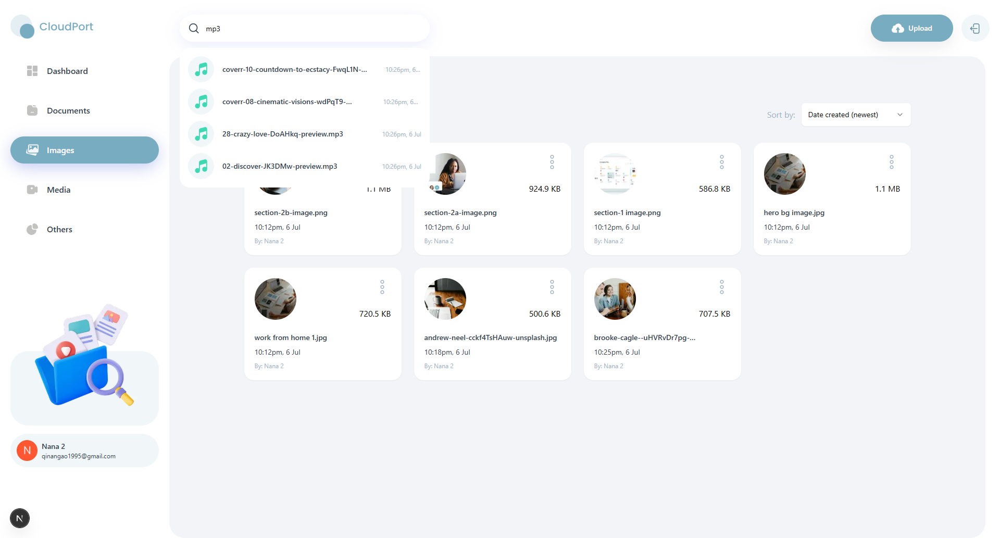
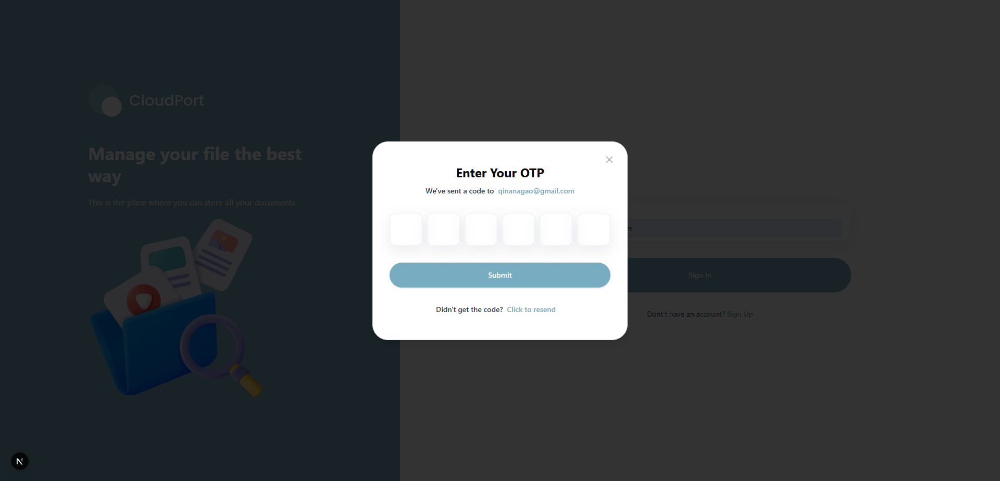

# 📁 Storage Management App

A modern, full-featured cloud storage solution built with cutting-edge technologies. This Google Drive clone provides seamless file management, sharing capabilities, and an intuitive user experience across all devices.

## 📸 Screenshots

### Dashboard Overview


_Main dashboard showing storage analytics and recent file activity_

### File Management


_File browser with upload, preview, and organisation features_

### Authentication


_Secure OTP-based login and registration system_

## ✨ Features

### 🔐 **Secure Authentication**

- Complete user authentication system powered by Appwrite
- OTP-based signup and login for enhanced security
- Secure logout functionality
- Random avatar generation based on user initials

### 📤 **File Upload & Management**

- **Multi-format Support**: Upload documents, images, videos, and audio files
- **File Organisation**: Browse, view, rename, and delete files with ease
- **Preview & Download**: View files in new tabs and download instantly
- **Storage Insights**: Real-time storage usage tracking and analytics

### 🤝 **Collaboration & Sharing**

- **Easy File Sharing**: Share files with others for seamless collaboration
- **Access Control**: Manage file permissions and sharing settings
- **Collaborative Workspace**: Enable team productivity with shared access

### 🎯 **Smart File Discovery**

- **Global Search**: Powerful search functionality across all files and shared content
- **Advanced Sorting**: Organise files by date, name, or size
- **File Type Categorisation**: Automatic grouping by file types for better organisation

### 📊 **Analytics Dashboard**

- **Storage Overview**: Visual representation of total and consumed storage
- **Recent Activity**: Track recent uploads and file activities
- **File Statistics**: Comprehensive breakdown of files by type using interactive charts
- **Usage Insights**: Monitor storage patterns and optimisation opportunities

### 🎨 **Modern User Experience**

- **Responsive Design**: Optimised for desktop, tablet, and mobile devices
- **Clean Interface**: Minimalist UI focusing on usability and aesthetics
- **Intuitive Navigation**: User-friendly interface for effortless file management

## 🚀 Tech Stack

- **Frontend**: Next.js 15 with React 19
- **Language**: TypeScript for type safety
- **Styling**: Tailwind CSS for responsive design
- **UI Components**: shadcn/ui for consistent design system
- **Database & Storage**: Appwrite for backend services
- **Charts**: Recharts for data visualization
- **Authentication**: Appwrite Auth with OTP verification

## 🛠️ Installation

1. **Clone the repository**

   ```bash
   git clone https://github.com/yourusername/storage-management-app.git
   cd storage-management-app
   ```

2. **Install dependencies**

   ```bash
   npm install
   # or
   yarn install
   # or
   pnpm install
   ```

3. **Set up environment variables**
   Create a `.env.local` file in the root directory:

   ```env
   NEXT_PUBLIC_APPWRITE_ENDPOINT=""
   NEXT_PUBLIC_APPWRITE_PROJECT=""
   NEXT_PUBLIC_APPWRITE_DATABASE=""
   NEXT_PUBLIC_APPWRITE_USERS_COLLECTION=""
   NEXT_PUBLIC_APPWRITE_FILES_COLLECTION=""
   NEXT_PUBLIC_APPWRITE_BUCKET=""
   NEXT_PUBLIC_APPWRITE_SECRET=""
   ```

4. **Configure Appwrite**

   - Create an Appwrite project
   - Configure storage bucket
   - Set up necessary collections

5. **Run the development server**

   ```bash
   npm run dev
   # or
   yarn dev
   # or
   pnpm dev
   ```

6. **Open your browser**
   Navigate to [http://localhost:3000](http://localhost:3000)

## 📱 Usage

1. **Sign Up/Login**: Create an account or login using OTP verification
2. **Upload Files**: Drag and drop or select files to upload
3. **Manage Files**: View, rename, delete, or download your files
4. **Share Content**: Share files with others using the sharing feature
5. **Track Usage**: Monitor your storage usage through the dashboard
6. **Search Files**: Use the global search to find specific files quickly

## 📄 Licence

This project is licensed under the MIT Licence - see the [LICENCE](LICENCE) file for details.

## 🙏 Acknowledgements

- [JavaScript-Mastery]-Youtobe channel for instruction and all assets
- [Next.js](https://nextjs.org/) - The React framework for production
- [Appwrite](https://appwrite.io/) - Backend-as-a-Service platform
- [Tailwind CSS](https://tailwindcss.com/) - Utility-first CSS framework
- [shadcn/ui](https://ui.shadcn.com/) - Beautiful UI components
- [Recharts](https://recharts.org/) - Composable charting library

---

**Happy coding! 🚀**
